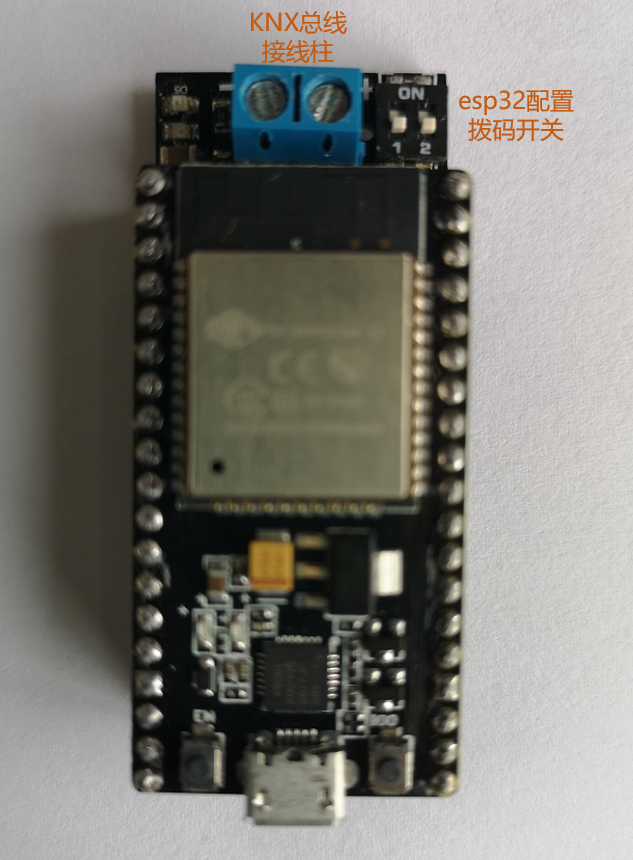
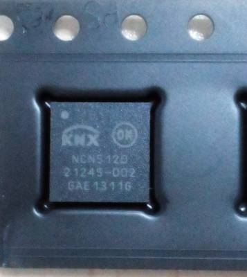
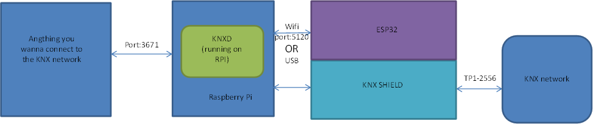
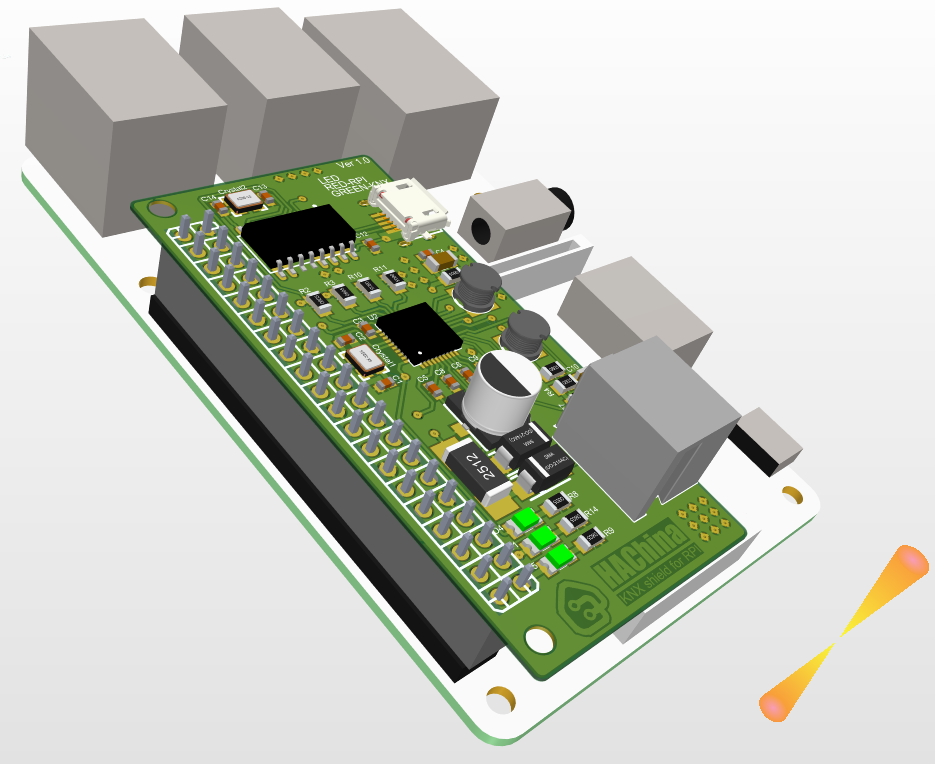

## KNX-Bridge ESP32 Shield
KNX-Bridge ESP32 Shield(hereinafter referred to as KNX-Shield) is a cheap method designed for the connetion between HomeAssistant and KNX.
Aslo you may use it as an IP-router independently.But it works better with HomeAssistant.

<<<<<<< HEAD
啊
=======
啊啊
>>>>>>> test
### Core components
KNX-Shield is basicly based on `NCN5120` , which is a receiver-transmitter IC suitbale for use in KNX twisted pair networks(KNX TP1-2556).

### Connetion
For the KNX connetion,you can just connect the red wire to the terminal which the silk screen was printed as `+`,
and the black wire to the terminal which the the silk screen was printed as `-`.
For the ESP32 connetion , you may just plug the esp32 into the shield with the usbport upward.

### Setting
KNX-Shield has two two-position-dial-switch .The one beside the terminal controls the ESP32 setting(of course it only works when you connect the ESP32)
Switch No.1 controls whether the wifi mode is `AP` or `STA`(on is AP) , while Switch No.2 controls whether the operation mode is `setting` or `runing` (on is setting).

The two-position-dial-switch below the micro-usbport control the NCN5120 communication setting (no matter the esp32 is connected or not).
Switch No.1 controls whether the communication mode is `serial` or `analog`(on is analog), while switch No.2 controls whether the bandrate is `38400bps` or `19200bps`(on means 38400bps).

### How to useSZDASD

The KNX-shield is part of the IP router system ,you need KNXD(a programs running on Linux) to compelet the IP-Router.
There is two way to combine the software and the hardware ,one is by USB ,the onther is by wifi(you gonna connect the esp32 with the shield).

### Coming soon
Designed for raspberrypi，with much more simple setting.Here comes RASP_KNX_Shield.Sure you can choose any kind of RPI to combine ，we still recommend 3B+，with enough power to run homeassistant and sweet Ethernet interface which it brings.

